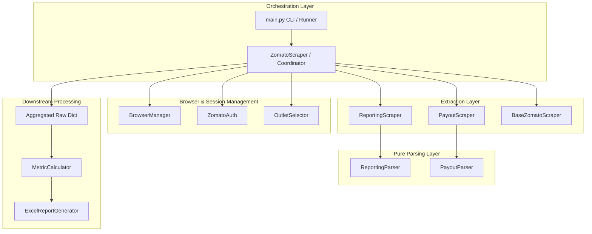
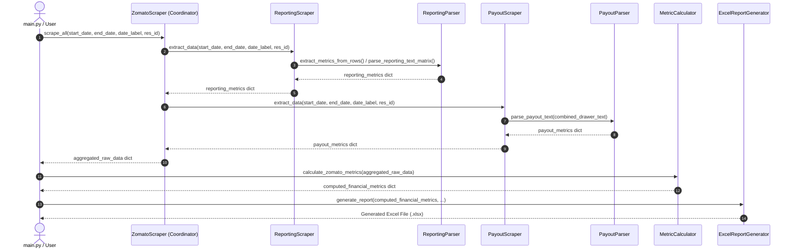

# Zomato Scraper Architecture & Modular Design

## 1. Overview & Architectural Goals

The Zomato Scraper is responsible for automating end-to-end data extraction from the Zomato Partner Portal across multiple tabs:
1. **Reporting Portal (`/business-reports`)**: Funnel metrics (Impressions, I2M, M2O, C2O), Operational metrics (Online %, KPT, MX Rejections, Delivered Orders, Sales).
2. **Finance Portal (`/payouts`)**: Financial breakdown from weekly settlement drawers (Item Subtotal, Discounts, Order Level Deductions, GST @18%, Commission, Ads, Net Payout / Cash in Bank).

### Core Architectural Goals:
- **Decoupling (Single Responsibility)**: Separation of concerns across Navigation, DOM interaction, Outlet selection, and Text/Data Parsing.
- **Isolated Failure Boundaries**: If Zomato alters their Payout drawer UI, it will not disrupt or crash Business Reports extraction, and vice-versa.
- **Independent Debuggability**: Parsers are pure Python logic decoupled from Playwright browser instances, allowing instant unit testing with mock HTML/text payloads.
- **Clean Extensibility**: New metrics or tab scrapers can be added without modifying unrelated modules.

---

## 2. High-Level System Architecture



---

## 3. Directory & Module Structure

The scraper is partitioned under `scrapers/zomato/` as follows:

```
scrapers/
├── browser_manager.py              # Playwright browser lifecycle & persistent sessions
├── zomato_scraper.py               # Facade & backward compatibility export
└── zomato/
    ├── __init__.py                 # Package exports (ZomatoScraper, parsers, sub-scrapers)
    ├── base.py                     # Base class with safe DOM locators & frame traversal
    ├── auth.py                     # Login status checker & session verification
    ├── outlet_selector.py          # Outlet selection modal & dialog handler
    ├── reporting_parser.py         # Pure parser for Reporting matrix table & fallback text
    ├── reporting_scraper.py        # Business Reports tab scraper & table navigator
    ├── payout_parser.py            # Pure parser for Payout side-drawer text & discount formulas
    ├── payout_scraper.py           # Finance -> Payouts scraper & cycle row navigator
    └── coordinator.py              # ZomatoScraper orchestrator (facade coordinating all steps)
```

---

## 4. Module Details & Responsibilities

### 4.1 `base.py` (`BaseZomatoScraper`)
- **Responsibility**: Common utility operations across all scrapers.
- **Key Methods**:
  - `find_clickable(candidates, timeout_ms)`: Safely tests multiple selector variations across both the main page and all embedded iframe frames.
  - `close_all_drawers_and_modals()`: Closes popups, overlays, and side drawers using `Escape` and close icon selectors.
  - `setup_network_interception()`: Intercepts internal XHR/JSON responses.
  - `parse_outlet_label(text)`: Static utility parsing restaurant names and numeric IDs from strings (e.g., `"The Spice Meridian (ID: 22663260)"`).

### 4.2 `auth.py` (`ZomatoAuth`)
- **Responsibility**: Authentication and session validation.
- **Key Methods**:
  - `check_login_status()`: Navigates to the dashboard, inspects URL redirects and key UI indicators to verify if the saved session is valid or needs interactive Google login.

### 4.3 `outlet_selector.py` (`OutletSelector`)
- **Responsibility**: Restaurant outlet selection across different page dialogs.
- **Handles**:
  - **Reporting Tab Filter Modal (`#modal`)**: Selects 'Outlet' on sidebar, clears previous selections, searches target ID/Name, selects checkbox, clicks 'Apply'.
  - **Payouts Dialog (`role='dialog'`)**: Ensures 'Restaurant' tab is active, searches target ID/Name, selects radio option, clicks 'Apply'.

### 4.4 `reporting_parser.py` (`ReportingParser`)
- **Responsibility**: **Pure data parsing** for the Business Reports matrix table.
- **Key Methods**:
  - `find_target_column_index(headers, start_date, end_date, date_label)`: Identifies the exact column index corresponding to the specified date range.
  - `extract_metrics_from_rows(rows, target_col_idx, ...)`: Maps DOM table row values to standard internal metric keys.
  - `parse_reporting_text_matrix(body_text, target_col_idx, headers, ...)`: Fallback parser filtering out relative comparison badges (e.g., `▲ +9%`, `▼ -3%`) to extract pure metric values.

### 4.5 `reporting_scraper.py` (`ReportingScraper`)
- **Responsibility**: Business Reports page navigation and table extraction.
- **Key Methods**:
  - `select_weekly_view()`: Switches granularity to Weekly view.
  - `expand_accordions()`: Expands nested table rows (e.g., 'Menu to order' -> 'Cart to order').
  - `scroll_to_reveal_columns()`: Horizontally scrolls table containers to render earlier weekly columns.
  - `extract_data(start_date, end_date, date_label, ...)`: Navigates to `/business-reports`, runs outlet selector, extracts DOM table, and delegates parsing to `ReportingParser`.

### 4.6 `payout_parser.py` (`PayoutParser`)
- **Responsibility**: **Pure text and financial breakdown parsing** for Payout details side drawer.
- **Handles**:
  - Item subtotal, net order value amount, packaging charges.
  - Hardcoded discount calculation:
    $$\text{Total Discount} = \text{Promos} + \text{Flat offs/Freebies/Gold} + \text{Delivery Discount}$$
  - Order level deductions (C), GST on service and payment mechanism fees @18% (D), and Commission:
    $$\text{Commission} = \text{Order Level Deductions} + \text{GST fee @18\%}$$
  - Growth investments (Ads), Cash in Bank / Net Payout, Hyperpure spend, and Rejections.

### 4.7 `payout_scraper.py` (`PayoutScraper`)
- **Responsibility**: Payouts page navigation and drawer lifecycle.
- **Key Methods**:
  - `select_payout_cycle_row(start_date, end_date, date_label)`: Locates and clicks the specific cycle row in the Past Cycles table.
  - `expand_drawer_accordions()`: Expands nested accordions inside the drawer (e.g., Net Order Value, Tax Deductions).
  - `extract_data(start_date, end_date, date_label, ...)`: Direct navigation to `/payouts`, selects outlet, opens drawer, captures text across frames, and delegates parsing to `PayoutParser`.

### 4.8 `coordinator.py` (`ZomatoScraper`)
- **Responsibility**: Unified orchestrator and backward-compatible entry point.
- Coordinates sequential extraction (`ReportingScraper` -> `PayoutScraper` -> `extract_restaurant_info`), merges results, and manages errors gracefully without pipeline crashes.

---

## 5. Data Flow & Metric Lifecycle



---

## 6. How to Debug Each Step Independently

Because the scraper is decoupled, you can debug any component in complete isolation without running the entire pipeline:

### 1. Debugging Payout Drawer Parsing (No browser needed)
If Payout drawer discount or deduction regex rules need tuning:
```python
from scrapers.zomato.payout_parser import PayoutParser

raw_drawer_text = """
Net order value (A) : ₹ 11,394.00
Item Subtotal : ₹ 14,465.00
Restaurant discount (Promos) : - ₹ 2,500.00
Restaurant discount (Flat offs, Freebies, Gold, relisted orders and others) : - ₹ 571.00
Order level deductions (C) : ₹ 3,186.44
GST on service and payment mechanism fees @ 18% : ₹ 573.56
Investments in growth (E) : ₹ 7,933.00
Estimated payout : ₹ 0.00
"""

parser = PayoutParser()
result = parser.parse_payout_text(raw_drawer_text)
print(result)
```

### 2. Debugging Reporting Column Indexing or Text Matrix (No browser needed)
```python
from datetime import datetime
from scrapers.zomato.reporting_parser import ReportingParser

headers = ["Metric", "Trend", "Week 33\n10 - 16 Aug 2026", "Week 34\n17 - 23 Aug 2026"]
parser = ReportingParser()
col_idx = parser.find_target_column_index(
    headers,
    start_date=datetime(2026, 8, 17),
    end_date=datetime(2026, 8, 23),
    date_label="17 - 23 Aug'26"
)
print("Target column index:", col_idx) # Expected: 3
```

### 3. Debugging Outlet Selection (In Browser)
```python
from scrapers.browser_manager import BrowserManager
from scrapers.zomato.outlet_selector import OutletSelector
from config import ZOMATO_REPORTS_URL

with BrowserManager(headless=False) as bm:
    page = bm.get_page()
    page.goto(ZOMATO_REPORTS_URL)
    selector = OutletSelector(page)
    success = selector.select_outlet(target_name_or_id="22663260")
    print("Outlet selected:", success)
```

### 4. Running Reporting Only or Payout Only
```python
from datetime import datetime
from scrapers.browser_manager import BrowserManager
from scrapers.zomato import ZomatoScraper

with BrowserManager(headless=False) as bm:
    page = bm.get_page()
    scraper = ZomatoScraper(page)
    
    # Run only reporting
    rep_data = scraper.navigate_and_extract_reporting_tab(
        start_date=datetime(2026, 8, 17),
        end_date=datetime(2026, 8, 23),
        restaurant_id="22663260"
    )
    print("Reporting data:", rep_data)
```

---

## 7. Adding New Metrics / Modifying Steps

1. **Adding a Reporting Table Metric**:
   - Update `ReportingParser.extract_metrics_from_rows()` or `ReportingParser.parse_reporting_text_matrix()` in `scrapers/zomato/reporting_parser.py`.
   - No changes needed in Payouts, Outlet Selector, or Auth.
2. **Adding a Payout Drawer Field**:
   - Update `PayoutParser.parse_payout_text()` in `scrapers/zomato/payout_parser.py`.
   - No changes needed in Reporting, Outlet Selector, or Auth.
3. **Updating Outlet Modal Selectors**:
   - Modify `OutletSelector` in `scrapers/zomato/outlet_selector.py`.
