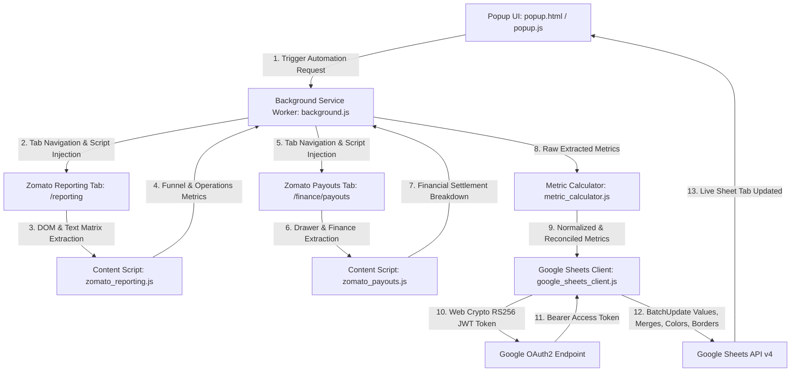

# Restaurant Report Automation — Chrome Extension (Architecture & Technical Details)

## 📌 1. Overview & Purpose
The **Restaurant Report Automation Chrome Extension** enables restaurant managers, analysts, and growth teams to automate the extraction of weekly and custom-date performance and financial settlement data directly from food delivery partner portals (**Zomato** and **Swiggy**) and automatically build formatted, side-by-side analytical tables in **Google Sheets**.

Because it runs directly inside Google Chrome (Manifest V3):
- **100% Real Session & Zero Bot Bans**: It leverages the user's active, genuine partner portal login sessions and residential IP address, eliminating Cloudflare challenges and datacenter IP blocks.
- **Serverless ($0 Cost)**: The extension performs all DOM parsing, financial reconciliations, Web Crypto RS256 token exchanges, and Google Sheets v4 API calls purely client-side.
- **Direct Multi-User Access**: Any team member who installs the extension can immediately trigger reports for any configured outlet and date range.

---

## 🏛️ 2. High-Level Architecture



---

## 🗂️ 3. Directory & File Organization

```
extension/
├── manifest.json                  # Manifest V3 configuration, permissions & host scopes
├── config.js                      # Config: Spreadsheet ID, default outlets, service account keys
├── extension-details.md           # Architecture & technical reference document (this file)
├── README.md                      # Developer mode installation and user instructions
│
├── popup/
│   ├── popup.html                 # Modern dashboard UI (Outlet Selector, Week Picker, Custom Dates, Log Console)
│   ├── popup.css                  # Responsive glassmorphism styling, glowing badges & dark console
│   └── popup.js                   # UI controller, local storage manager, log stream listener
│
├── background/
│   └── background.js              # Service worker managing tabs, coordinating scrapers & Google Sheets sync
│
├── content_scripts/
│   ├── zomato_outlet.js           # Selects target outlet/restaurant across modals and search dropdowns
│   ├── zomato_reporting.js        # Extracts business reports matrix table (Impressions, Funnel, KPT, Orders, Sales)
│   └── zomato_payouts.js          # Locates weekly cycle row, opens drawer, extracts financial settlement breakdown
│
├── lib/
│   ├── date_utils.js              # Monday-Sunday weekly date ranges & custom date label generator
│   ├── metric_calculator.js       # Business logic, mathematical reconciliation & percentage formatting
│   └── google_sheets_client.js    # In-browser RS256 JWT signer & Google Sheets API v4 batch updater
│
└── icons/
    ├── icon16.png
    ├── icon48.png
    └── icon128.png
```

---

## 📊 4. Financial & Operational Metric Definitions

| # | Metric Line Item | Excel/Sheets Type | Source / Calculation Formula |
| :- | :--- | :--- | :--- |
| 1 | **Orders** | Integer (`#,##0`) | Delivered orders from Business Reports tab (or Payouts fallback) |
| 2 | **Subtotal** | Integer (`#,##0`) | Item subtotal under Net Order Value (Payouts side-drawer) |
| 3 | **Total Discount** | Integer (`#,##0`) | `Restaurant discount (Promos) + Restaurant discount (Flat offs, Freebies, Gold) + Delivery discount` |
| 4 | **Sales after discount** | Integer (`#,##0`) | `Subtotal - Total Discount` (Reconciled with Net Order Value) |
| 5 | **Net order value** | Integer (`#,##0`) | `Sales after discount / Orders` (Numeric, rounded to nearest integer) |
| 6 | **Packaging Charges** | Integer (`#,##0`) | Packaging charges (or `0` if not present) |
| 7 | **Commission** | Integer (`#,##0`) | `Order level deductions + GST on service & payment mechanism fees @18%` |
| 8 | **ads** | Integer (`#,##0`) | Investments in growth |
| 9 | **Cash in Bank** | Integer (`#,##0`) | Estimated payout / Net payout (Highlighted row: `#F9CB9C`, Bold) |
| 10 | **Discount %** | String (`@`) | `(Total Discount / Subtotal) * 100` -> `"XX.XX%"` |
| 11 | **Commission %** | String (`@`) | `(Commission / Sales after discount) * 100` -> `"XX.XX%"` |
| 12 | **Ads %** | String (`@`) | `(Ads / Subtotal) * 100` -> `"XX.XX%"` |
| 13 | **Payout %** | String (`@`) | `(Cash in Bank / Subtotal) * 100` -> `"XX.XX%"` (Highlighted row: `#F9CB9C`, Bold) |
| 14 | **Visibility** | String (`@`) | Online % / Visibility funnel metric -> `"XX.XX%"` |
| 15 | **KPT** | Integer (`#,##0`) | Kitchen Prep Time (minutes) |
| 16 | **Impressions** | Integer (`#,##0`) | Total impressions count |
| 17 | **I2M** | String (`@`) | Impressions to Menu opens -> `"XX.XX%"` |
| 18 | **Menu Opens** | Integer (`#,##0`) | `Impressions * (I2M / 100)` |
| 19 | **C2O** | String (`@`) | Cart to Order conversion -> `"XX.XX%"` |
| 20 | **M2O** | String (`@`) | Menu to Order conversion -> `"XX.XX%"` (Bold) |
| 21 | **Mx Rejections** | Integer (`#,##0`) | Rejected / Cancelled orders |

> [!IMPORTANT]
> **Excel / Google Sheets Cell Value Rule**: All numeric values must be written as **direct pre-calculated numeric values** (never uncalculated formula strings like `"=B6-B7"`). All percentages must be pre-formatted strings (`"XX.XX%"`).

---

## 🎨 5. Google Sheets Layout & Styling Specs

Each report run generates a structured 4-column table placed side-by-side with a 1-column blank gap:

```
[ Col A / startCol ]   [ Col B ]   [ Col C ]   [ Col D ]
+------------------------------------------------------+
| Row 1: [Restaurant Name] (Id: [Restaurant ID])       |  <- Merged A1:D1, BG: #CCA9C2 (Light Mauve), Bold 11pt Center
+------------------------------------------------------+
| Row 2: [Date Range Label: e.g. 24 - 30 Aug'26]      |  <- Merged A2:D2, BG: #CCA9C2 (Light Mauve), Bold 11pt Center
+------------------------------------------------------+
| Row 3: Weekly Report                                 |  <- Merged A3:D3, BG: #434343 (Dark Grey), Text: #FFFFFF Bold 11pt
+------------------------------------------------------+
| Row 4: Line Items   | Zomato    | Swiggy    | Z+S    |  <- BG: #8EA6B4, #D32F2F (Red), #E69138 (Orange), #A9D18E (Green)
+---------------------+-----------+-----------+--------+
| Rows 5-25: Metrics  | Values    | Values    | Values |  <- Thin black borders, #F9CB9C Peach highlight on Cash in Bank & Payout %
+------------------------------------------------------+
```

### Color Palette (Hex & RGB)
- **Title & Date BG**: `#CCA9C2` (`r: 0.792, g: 0.663, b: 0.761`)
- **Report Type BG**: `#434343` (`r: 0.263, g: 0.263, b: 0.263`), Font: `#FFFFFF`
- **Line Items Header**: `#8EA6B4` (`r: 0.557, g: 0.651, b: 0.706`)
- **Zomato Header**: `#D32F2F` (`r: 0.827, g: 0.184, b: 0.184`)
- **Swiggy Header**: `#E69138` (`r: 0.902, g: 0.569, b: 0.220`)
- **Z+S Header**: `#A9D18E` (`r: 0.663, g: 0.820, b: 0.557`)
- **Highlight (Cash in Bank & Payout %)**: `#F9CB9C` (`r: 0.976, g: 0.796, b: 0.612`)

---

## 🔐 6. Google Service Account In-Browser Authentication
Google Sheets API v4 requires an OAuth2 access token with `https://www.googleapis.com/auth/spreadsheets` scope. The extension accomplishes this inside the browser without requiring user sign-in:
1. **Private Key Import**: Converts the PEM private key from `service_account.json` into a CryptoKey via `crypto.subtle.importKey("pkcs8", ..., { name: "RSASSA-PKCS1-v1_5", hash: "SHA-256" })`.
2. **JWT Creation**:
   - Header: `{"alg": "RS256", "typ": "JWT"}`
   - Claim Set:
     ```json
     {
       "iss": "juno-digitals@juno-digitals-automation.iam.gserviceaccount.com",
       "scope": "https://www.googleapis.com/auth/spreadsheets https://www.googleapis.com/auth/drive",
       "aud": "https://oauth2.googleapis.com/token",
       "exp": Math.floor(Date.now() / 1000) + 3600,
       "iat": Math.floor(Date.now() / 1000)
     }
     ```
3. **JWT Signature**: Signs header + payload with `crypto.subtle.sign`.
4. **Token Exchange**: `POST` to `https://oauth2.googleapis.com/token` with `grant_type=urn:ietf:params:oauth:grant-type:jwt-bearer` to retrieve the `access_token`.
5. **Direct API Call**: Uses `access_token` to call `https://sheets.googleapis.com/v4/spreadsheets/{spreadsheetId}:batchUpdate`.

---

## 🔄 7. Step-by-Step Zomato Extraction Sequence

1. **Tab Creation / Navigation**:
   - `background.js` opens/reuses a tab to `https://www.zomato.com/partners/onlineordering/reporting`.
2. **Outlet Switching (`zomato_outlet.js`)**:
   - Locates outlet header button, opens outlet modal, searches for `restaurant_id` or `restaurant_name`, selects matching outlet.
3. **Reporting Extraction (`zomato_reporting.js`)**:
   - Selects `Weekly` view toggle button.
   - Expands `Menu to order` -> `Cart to order` chevron accordion.
   - Scrolls horizontally to ensure all column headers are rendered in DOM.
   - Locates target column index matching ISO week number or date range label (e.g. `Week 36` or `24 - 30 Aug`).
   - Extracts Delivered Orders, Reporting Sales, AOV, Visibility, KPT, Impressions, I2M, C2O, M2O, and Rejections.
4. **Payouts Extraction (`zomato_payouts.js`)**:
   - Navigates tab to `https://www.zomato.com/partners/onlineordering/finance/payouts`.
   - Locates target weekly cycle row in Past cycles table.
   - Clicks to open the payout details side-drawer.
   - Expands accordions (`Net order value`, `Order level deductions`, `Tax deductions`).
   - Extracts Subtotal (Item total), Discount Promos, Flat offs, Delivery discount, Total discount, Order deductions, GST @18%, Ads (Investments in growth), and Cash in Bank (Est payout).
5. **Normalization & Reconcile (`metric_calculator.js`)**:
   - Reconciles `Sales after discount = Subtotal - Total Discount`.
   - Computes `Net order value = Sales after discount / Orders`.
   - Computes `Commission = Order level deductions + GST 18%`.
   - Computes formatted percentages (`Discount %`, `Commission %`, `Ads %`, `Payout %`, etc.).
6. **Google Sheets Sync (`google_sheets_client.js`)**:
   - Finds next available starting column in target worksheet.
   - Executes batch update writing cell values, merging rows 1-3, applying borders, cell background fills, and column widths.
   - Posts live link back to popup UI.
